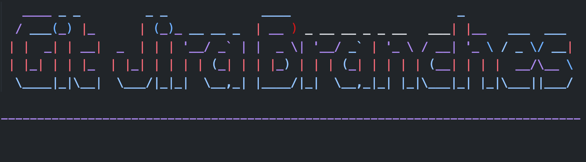

<p align="center">
    
</p>

An opinionated CLI tool to create branch for your in-progress JIRA ticket, without leaving your terminal.

[](https://asciinema.org/a/ne8etrh1CvfdyinbDIn7HEtK1)

## Key Things to Be Aware Of
1. The branches are always based out of the latest commit on the primary branch.
2. Forces developer to have only one ticket in "in progress" state at any given time.
3. branch naming convention `<ticketId>/<ticketSummary>`, where `<ticketId>` is the JIRA ticket id and `<ticketSummary>` is kebabcased version of the summary of the ticket (JIRA title).

## Installation
1. ```touch gjb-config.json```
2. Add `gjb-config.json` to the .gitignore list.
3. Add the following values to your `gjb-config.json` file.

```json
{
    "baseUrl": "<your orgs JIRA url>"
    "mail": "<your email id associated with JIRA>"
    "token": "<your JIRA API token>"
    "primaryBranch": "<you git repo's primary branch name>"
}
```

## Usage
TBD